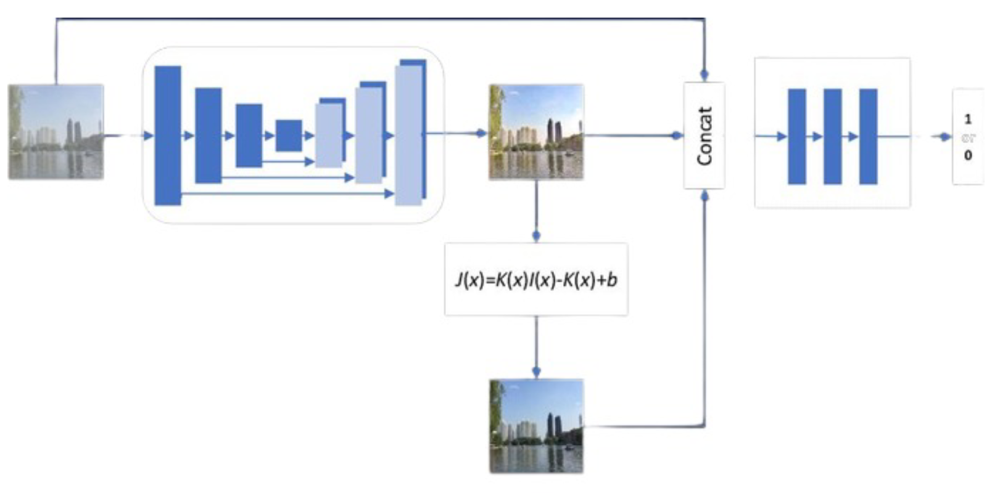
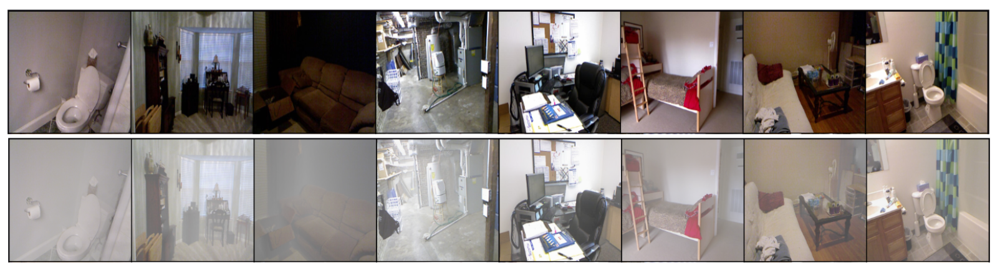
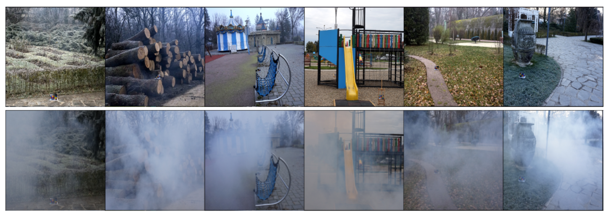
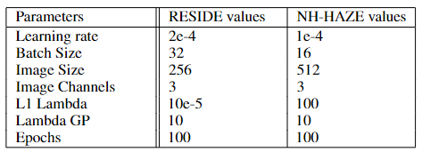
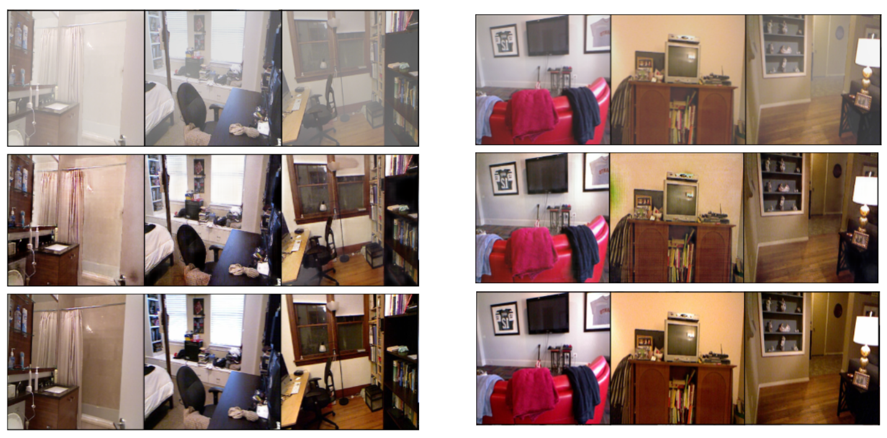
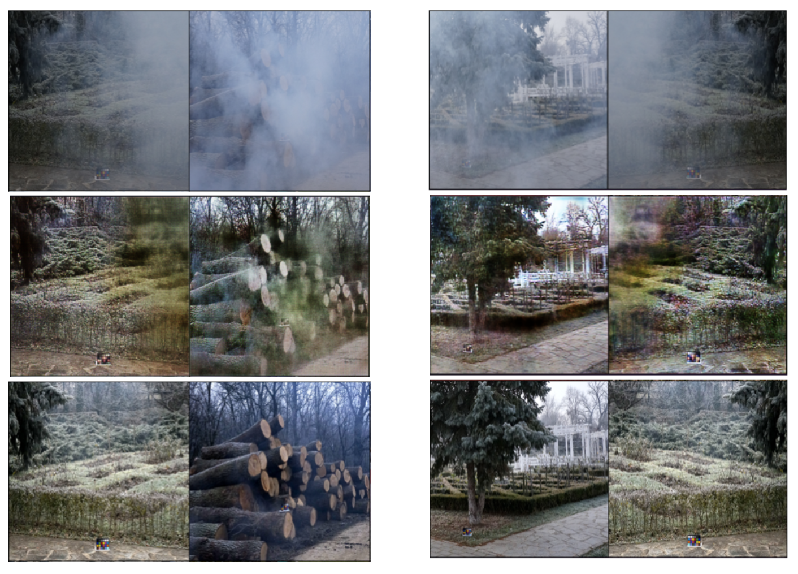
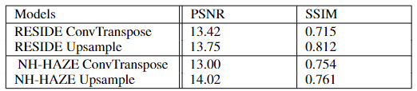

# Single Image Dehazing 

This repository contains code for Single Image Dehazing using Pix2Pix GAN. The project trains a conditional GAN to remove haze from images, producing clearer, more visually appealing (and perceptually faithful) reconstructions. 


## General Architecture and Overview:

Haze, caused by particles such as dust or smoke, often impairs image clarity and color fidelity. Traditional physics-based methods rely on estimating transmission maps and other parameters, but can be limited by their assumptions and inability to handle complex real-world conditions.

By leveraging pix2pix (a conditional GAN framework), we map hazy images to their corresponding haze-free counterparts using paired training data. The model consists of:


* **A Generator (U-Net):**
    * Encoder-decoder architecture with skip connections to preserve low-level features.
    * LayerNorm in place of BatchNorm for more stable training.
    * Nearest Neighbor Upsampling + Convolution instead of transposed convolutions to reduce checkerboard artifacts.

* **A Discriminator (ConvNet):**
    * Classifies the image as real or fake for adversarial training.


## Datasets: 

Two main datasets are used for training and evaluation:

**RESIDE (indoor subset):**

It is a large-scale benchmark consisting of both synthetic and real-world hazy images, RESIDE
highlights diverse data sources and image contents, and is divided into five subsets, each serving
different training or evaluation purposes. We used a subset of the dataset using only the indoor images. We used a total of 1399 clear images each having 10 hazy counterparts to them each of resolution 640x420 pixels. These were resized to
256x256.

**NH-HAZE:**

The NH-HAZE dataset is a benchmark dataset specifically designed for evaluating image dehazing
algorithms on non-homogeneous (spatially varying) hazy scenes. It contains a total of 55 pairs of real-
world outdoor hazy and corresponding haze-free (ground truth) images. The hazy and corresponding
haze-free image pairs have the same resolution, which varies across the dataset from 600x400 to
3264x2448 pixels. 
We used the entire dataset of all 55 image pairs. These were resized to 512x512 pixels. 


## Repository Structure: 

```
.
├── images/
│   ├── ...                    # Images used in the project report
│
├── nhhaze/
│   ├── evaluation/            # Images used for visual inspection for Conv2d
│   ├── evaluation_upsample/   # Images used for visual inspection for Upsampling
│   ├── config.py              # Configuration/hyperparameter settings for NH-HAZE
│   ├── discriminator.py       # Discriminator code for NH-HAZE
│   ├── generator.py           # Generator code (transposed convolution) for NH-HAZE
│   ├── generator_upsample.py  # Generator code (nearest neighbor upsampling) for NH-HAZE
│   ├── nhhaze_dataset.py      # DataLoader for NH-HAZE
│   ├── train.py               # Training script for NH-HAZE
│   └── utils.py               # Utility functions (metrics, logging, etc.)
│
├── reside/
│   ├── evaluation/            # Images used for visual inspection for Conv2d
│   ├── evaluation_upsample/   # Images used for visual inspection for Upsampling
│   ├── config.py              # Configuration/hyperparameter settings for RESIDE
│   ├── discriminator.py       # Discriminator code for RESIDE
│   ├── generator.py           # Generator code (transposed convolution) for RESIDE
│   ├── generator_upsample.py  # Generator code (nearest neighbor upsampling) for RESIDE
│   ├── reside_dataset.py      # DataLoader for RESIDE
│   ├── train.py               # Training script for RESIDE
│   └── utils.py               # Utility functions (metrics, logging, etc.)
│
├── Paper.pdf                  # Project report/paper
└── README.md                  # Top-level documentation for the entire repository
```

## HyperParameters:



## Metrics and Results:
We evaluate the dehazed outputs using:

1. **Peak Signal-to-Noise Ratio (PSNR)**
2. **Structural Similarity Index (SSIM)**
3. **Visual Inspection** 



Pix2pix results for RESIDE, The images on the left side are generated using Transpose Convolutions and the ones on the right are generated using Upsampling. Top: Hazy images, Middle: Generated images, Bottom: Ground Truth images.



Pix2pix results for NH-Haze, The images on the left side are generated using Transpose Convolutions and the ones on the right are generated using Upsampling. Top: Hazy images, Middle: Generated images, Bottom: Ground Truth images.



PSNR and SSIM scores.

## Acknowledgements: